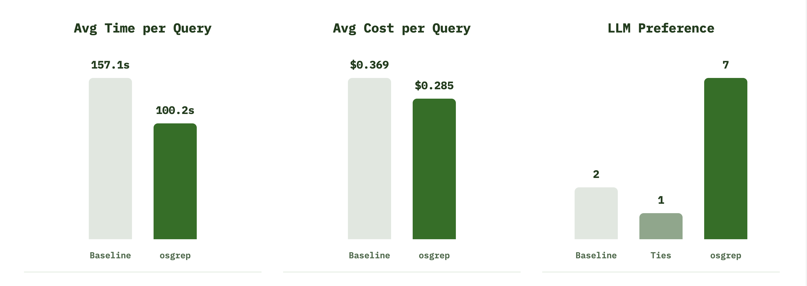

<div align="center">
  <h1>grepmax</h1>
  <p><em>Slash tokens. Save time. Semantic search for your coding agent.</em></p>

  <a href="https://www.npmjs.com/package/grepmax">
    
  </a>

  <a href="https://www.npmjs.com/package/grepmax">
    
  </a>

  <a href="https://opensource.org/licenses/Apache-2.0">
    
  </a>

  <a href="https://deepwiki.com/reowens/grepmax">
    
  </a>

<a>
  
</a>
</div>


Natural-language search that works like `grep`. Fast, local, and built for coding agents.

- **Semantic:** Finds concepts ("where do transactions get created?"), not just strings.
- **Call Graph Tracing:** Map dependencies with `trace`, find tests with `test`, measure blast radius with `impact`.
- **Role Detection:** Distinguishes `ORCHESTRATION` (high-level logic) from `DEFINITION` (types/classes).
- **Local & Private:** 100% local embeddings via ONNX (CPU) or MLX (Apple Silicon GPU).
- **Centralized Index:** One database at `~/.gmax/` — index once, search from anywhere.
- **Agent-Ready:** `--agent` flag returns compact one-line output — ~89% fewer tokens than default.

## Quick Start

Requires **Node.js 22.12.0 or newer**.

```bash
npm install -g grepmax        # 1. Install
cd my-repo && gmax add        # 2. Add + index
gmax "where do we handle auth?" --agent  # 3. Search
```

No setup required — gmax auto-detects your platform (GPU on Apple Silicon, CPU elsewhere) and downloads models on first use.

### Setup & Config

```bash
gmax setup                    # Interactive wizard (models, embedding mode, plugins)
gmax config                   # View current settings
gmax config --embed-mode gpu  # Switch to GPU (Apple Silicon)
gmax config --worker-threads 2  # Cap worker processes (auto = default); applies on daemon restart
gmax doctor                   # Health check
gmax doctor --fix             # Auto-repair (compact, prune, remove stale locks)
```

### Core Commands

```bash
gmax "where do we handle auth?" --agent  # Semantic search (compact output)
gmax extract handleAuth                  # Full function body with line numbers
gmax peek handleAuth                     # Signature + callers + callees
gmax trace handleAuth -d 2              # Call graph (2-hop)
gmax skeleton src/lib/auth.ts           # File structure (bodies collapsed)
gmax symbols auth                       # List indexed symbols
```

### Analysis Commands

```bash
gmax log src/lib/auth.ts                 # Git commit history for a path or symbol
gmax test handleAuth                     # Find tests via reverse call graph
gmax impact handleAuth                   # Dependents + affected tests
gmax similar handleAuth                  # Find similar code patterns
gmax audit --top 10                      # God nodes, hub files, file cycles, dead candidates
gmax surprises --experimental --agent    # Experimental: similar but graph-disconnected file pairs
gmax dead handleAuth                     # Unused-symbol check via call graph (DEAD / PUBLIC EXPORT / LIVE)
gmax context "auth system" --budget 4000 # Token-budgeted topic summary
gmax context src/lib/auth.ts --budget 4000 # Deterministic file/path context
```

### Project Commands

```bash
gmax project                  # Languages, structure, key symbols
gmax related src/lib/auth.ts  # Dependencies + dependents
gmax status                   # All indexed projects + chunk counts
gmax status --json            # The same plus daemon, settings and workers, as JSON
```

The recorded benchmark below showed about 20% fewer LLM tokens and a 30% speedup on its workload. Results depend on the repository, query and agent workflow.

<div align="center">
  
</div>

## Agent Plugins

gmax integrates with Claude Code, OpenCode, Codex, and Factory Droid. Install all detected clients at once:

```bash
gmax plugin add               # Install all detected clients
gmax plugin                   # Show plugin status
gmax plugin remove             # Remove all plugins
```

Or manage individually:

```bash
gmax plugin add claude         # Claude Code only
gmax plugin add opencode       # OpenCode only
gmax plugin add codex          # Codex only
gmax plugin add droid          # Factory Droid only
gmax plugin remove claude      # Remove specific plugin
```

After upgrading with `npm install -g grepmax@latest`, run `gmax plugin update` (or `gmax plugin update <client>`) to refresh integrations. Package installation does not modify your agent configuration; its postinstall script only prints this reminder.

### How it works per client

- **Claude Code:** Plugin with hooks (SessionStart, SessionEnd, CwdChanged, SubagentStart, PreToolUse). Model uses CLI via `Bash(gmax ... --agent)`.
- **OpenCode:** Tool shim with dynamic SKILL + session plugin for daemon startup. Model calls gmax tool directly.
- **Codex:** MCP server registration + AGENTS.md skill instructions.
- **Factory Droid:** Skills + SessionStart/SessionEnd hooks for daemon lifecycle.

### MCP Server

MCP is local-only: the client spawns it and communicates through stdin/stdout pipes. It has no HTTP, SSE, or TCP listener and cannot be reached over the network. The daemon socket is restricted to your user account.

`gmax mcp` uses the official MCP SDK v2.3.0 and serves both legacy (2025 handshake) and modern (2026-07-28 discovery and per-request metadata) clients over the same stdio entry. Discovery and catalog listing perform no daemon, model or watcher startup. Index-reading tools acquire watch leases lazily; one timer renews the primary projects actually used, and disconnect closes the SDK connection and its timer.

Clients requesting progress receive operation-stage messages with increasing stage counts and no estimated percentage. Cancelling a daemon read closes that request's IPC connection and prevents subsequent tool operations or fallback work; concurrent requests and the session's watch leases continue. An already-running local native query finishes under its existing deadline before its store closes. Cancellation does not undo indexing writes or interrupt optional LLM work.

`gmax mcp` starts a stdio-based MCP server for clients that support MCP but can't run shell commands (Cursor, Windsurf, custom agents). Search-backed tools use the singleton daemon when available, avoiding a separate embedding worker per MCP session, and use an in-process worker for supported offline/secondary-store access. An unsupported daemon command requires `gmax watch restart`.

`semantic_search`, `trace_calls`, `dead`, and `index_status` also advertise output schemas and return `structuredContent` with `schemaVersion: 1`, alongside the existing text. Search matches follow the same scope and display filters and include paths, one-based start/end lines, symbols, scores (null when unavailable), and warnings. Trace results preserve caller ancestry and edge confidence; unresolved callees have no location, and omitted callee/importer counts are explicit. Graph conclusions carry `approximate: true`. Index health includes embedding identity, watcher/reconciliation state, and the last compaction result; unavailable health is null or unobserved. These four tools advertise read-only, non-destructive, closed-world annotations. Other tools retain their current contracts.

| Tool | Description |
| --- | --- |
| `semantic_search` | Search by meaning. Pointer mode matches CLI `--agent` output; `detail=code/full` returns snippets. |
| `code_skeleton` | File structure with bodies collapsed (~4x fewer tokens). |
| `trace_calls` | Call graph: importers, callers (multi-hop), callees with file:line. |
| `extract_symbol` | Complete function/class body by symbol name. |
| `peek_symbol` | Compact overview: signature + callers + callees. |
| `dead` | Unused-symbol check via call graph. Returns `DEAD`, `PUBLIC EXPORT`, or `LIVE` with caller count. |
| `audit` | Graph summary: god nodes, hub files, symbol-derived file dependency cycles, and dead-code candidates. |
| `surprising_connections` | Experimental orientation signal: embedding-similar file pairs with no direct indexed static file edge. Requires `experimental:true`. |
| `get_neighbors` | Graph primitive: symbols reachable from a node along call edges within N hops. |
| `find_paths` | Graph primitive: shortest call-graph path between two symbols. |
| `subgraph_for_files` | Graph primitive: local dependency subgraph for a set of files. |
| `list_symbols` | Indexed symbols with role and export status. |
| `list_projects` | List every indexed project (name, root, status, chunks) to pick a search scope. |
| `index_status` | Index health: chunks, files, projects, watcher status. |
| `summarize_project` | Project overview: languages, structure, key symbols, entry points. |
| `summarize_directory` | Compatibility entry; summarization is disabled and generates no summaries. |
| `related_files` | Dependencies and dependents by shared symbols. |
| `recent_changes` | Recently modified indexed files. |
| `diff_changes` | Search scoped to git changes. |
| `find_tests` | Find tests via reverse call graph. |
| `impact_analysis` | Dependents + affected tests for a symbol or file. |
| `find_similar` | Vector similarity search. |
| `build_context` | Token-budgeted topic summary. |
| `investigate` | Agentic codebase Q&A using local LLM + gmax tools. |
| `review_commit` | Review a git commit for bugs, security issues, and breaking changes. |
| `review_report` | Get accumulated code review findings for the current project. |
| `review_risk` | Deterministic risk ranking of symbols a commit touches (blast radius × tests × churn). No LLM. |

## Search Options

```bash
gmax "query" [options]
```

| Flag | Description | Default |
| --- | --- | --- |
| `--agent` | Compact one-line output for AI agents. | `false` |
| `-m <n>` | Max results. | `5` |
| `--per-file <n>` | Max matches per file. | `3` |
| `--role <role>` | Filter: `ORCHESTRATION`, `DEFINITION`, `IMPLEMENTATION`. | — |
| `--lang <ext>` | Filter by extension (e.g. `ts`, `py`). | — |
| `--file <name>` | Filter by filename. | — |
| `--exclude <prefix>` | Exclude path prefix. | — |
| `--symbol` | Append call graph after results. | `false` |
| `--imports` | Prepend file imports per result. | `false` |
| `--name <regex>` | Filter by symbol name. | — |
| `--in <subpath>` | Restrict to a sub-path of the project (repeatable). | — |
| `--seed-file <path>` | Bias results toward files in your working context (repeatable). | — |
| `--seed-symbol <name>` | Bias results toward an identifier you're working with (repeatable). | — |
| `--skeleton` | Show file skeletons for top matches. | `false` |
| `--context-for-llm` | Full function bodies + imports per result. | `false` |
| `--budget <tokens>` | Cap output tokens (for `--context-for-llm`). | `8000` |
| `--explain` | Show scoring breakdown per result. | `false` |
| `--scores` | Show relevance scores. | `false` |
| `--compact` | Compact hits view (paths + line ranges + role/preview). | `false` |
| `--plain` | Disable ANSI colors and use simpler formatting. | `false` |
| `-c, --content` | Show full chunk content instead of snippets. | `false` |
| `-C <n>` | Context lines before/after. | `0` |
| `-s, --sync` | Sync local files to the store before searching. | `false` |
| `--root <dir>` | Search a different project. | cwd |
| `--all-projects` | Search every indexed project; results grouped by project. | `false` |
| `--projects <list>` | Search only these projects (comma-separated names). | — |
| `--exclude-projects <list>` | With `--all-projects`, skip these projects. | — |
| `--min-score <n>` | Minimum score relative to this query’s top match, not an absolute confidence threshold. | `0` |

## Experimental Orientation

`gmax surprises --experimental` finds file pairs that are semantically similar but not already connected by the indexed static graph. Use it for architecture orientation, duplicate-logic sweeps, and cross-package drift checks, not as proof that two files are unrelated.

```bash
gmax surprises --experimental --agent
gmax surprises --experimental --in packages/app/src --dir-depth 4 --agent
gmax surprises --experimental --exclude generated --top 10
```

The CLI and MCP output include score, max similarity, pair count, representative symbols, directory buckets, top similarities, applied penalties, and `gmax skeleton` follow-up hints. On large monorepos, prefer `--in`/`--exclude`; the default scan is capped at 50,000 rows and user-provided `--max-rows` is capped at 100,000. If a narrow `--in` scope returns no findings, increase `--dir-depth` so subdirectories are compared inside the scope.

## Background Daemon

A single daemon watches your projects via native OS file events (FSEvents/inotify). Changes are detected in sub-second and incrementally reindexed. All writes to LanceDB are routed through the daemon via IPC, eliminating lock contention.

The daemon watches only projects that are in use: each Claude Code session (its MCP server and session hooks) holds a lease on its project, and `gmax add` / `gmax index` take a short one. When the last lease ends the project is unwatched; its index stays searchable, and the next session's catch-up scan picks up whatever changed in between. Set `GMAX_WATCH_ALL=1` to watch every registered project instead.

```bash
gmax watch --daemon -b        # Start daemon manually
gmax watch stop               # Stop daemon
gmax watch restart            # Stop it, wait for it to exit, start a fresh one (--json)
gmax status                   # See all projects + watcher status
```

Adding or indexing a project can start the daemon automatically. MCP acquires primary-project watch leases lazily when an index-reading tool is used; discovery and catalog listing start no background work. It shuts down after 4 hours of inactivity, and hands off to a fresh daemon after 24 hours or once its memory footprint passes 2.5 GB. File-change batches are processed on up to four worker processes by default, added only when work backs up, with one kept free for searches; LanceDB compaction runs after writes rather than on every maintenance tick.

`gmax watch status` reports failed files, native watcher recovery or polling, dropped-event counts, and the last complete filesystem reconciliation. Polling scans run every five minutes, so recent edits can lag. Search and MCP responses retain health warnings even after the file queue drains. A complete reconciliation means the filesystem scan completed; queued embedding work can still be pending.

Temporary embedding backend outages preserve existing indexed rows and retry with backoff from five seconds up to one minute, without exhausting individual files' retry budgets. MLX failures report bounded transport/protocol details in the daemon log. `gmax status --json` includes the most recent resource snapshot when a recycle threshold has been reached; these counters help investigate memory growth, whose cause requires measurement over time.

## Running under the Claude Code sandbox

Claude Code's Bash sandbox (the default on macOS) allows writes only under the working directory,
the added directories, and the session temp dir, and blocks every Unix socket unless it is listed.
Child processes inherit the profile, so a gmax command run from an agent shell inherits it too —
and gmax needs both kinds of access. A read command either asks the daemon over
`~/.gmax/daemon.sock`, or, with no daemon running, opens the shared store itself; opening the store
takes a lease, which means a `mkdir` under `~/.gmax`. A "read" is a writer as far as the filesystem
is concerned.

Two settings keys cover it (`~/.claude/settings.json`, or the project's `.claude/settings.json`):

```json
"sandbox": {
  "network": { "allowUnixSockets": ["~/.gmax/daemon.sock"] },
  "filesystem": { "allowWrite": ["~/.gmax"] }
}
```

| Key | What it unlocks |
| --- | --- |
| `sandbox.network.allowUnixSockets` | Every read command — search, `test`, `impact`, `trace`, `peek`, `status` — via the daemon. This is the one that matters day to day. |
| `sandbox.filesystem.allowWrite` | The in-process fallback, used only when no daemon is running (autostart disabled, CI). With a daemon up, nothing needs it. |

Without them gmax refuses rather than failing with a bare `EPERM`, exits `2`, and prints the key to add:

```
gmax: cannot reach the daemon socket from this sandbox. Add to Claude Code settings: "sandbox": {"network": {"allowUnixSockets": ["~/.gmax/daemon.sock"]}}
gmax: cannot open the store from this sandbox. Add to Claude Code settings: "sandbox": {"filesystem": {"allowWrite": ["~/.gmax"]}}
```

`gmax doctor` reports the same thing ahead of time as `WARN  Claude Code sandbox` whenever your
settings enable the sandbox without allowing the socket or the store directory. It never edits
Claude Code settings, `--fix` included — they are not gmax's files to write.

On Linux the per-socket list does not exist; the only option is
`"network": { "allowAllUnixSockets": true }`. See
[`docs/known-limitations.md`](docs/known-limitations.md).

## Local LLM (optional)

gmax can use a local LLM (via llama-server) for agentic codebase investigation. This is entirely opt-in and disabled by default — gmax works fine without it.

> **Memory footprint.** `gmax llm start`, `investigate`, and `review` can load a multi-GB
> GGUF model (typical coding models run 16–21 GB). On a memory-constrained machine that can stall
> or hang the host. Start it deliberately, not as a reflex — and if you run coding agents against
> this repo, they should be told not to invoke these on their own initiative. The bundled skill
> already carries that instruction.
>
> Everything else in gmax — search, `trace`, `impact`, `context`, `--context-for-llm` — uses
> local embeddings and the index without a generative LLM.

```bash
gmax llm on                   # Enable LLM features (persists to config)
gmax llm start                # Start llama-server (auto-starts daemon too)
gmax llm status               # Check server status
gmax llm stop                 # Stop llama-server
gmax llm off                  # Disable LLM + stop server
```

### Investigate

Ask questions about your codebase — the LLM autonomously uses gmax tools (search, trace, peek, impact, related) to gather evidence and synthesize an answer.

```bash
gmax investigate "how does authentication work?"
gmax investigate "what would break if I changed VectorDB?" -v
gmax investigate "where are API routes defined?" --root ~/project
```

### Review

Automatic code review on git commits. Extracts the diff, gathers codebase context (callers, dependents, related files), and prompts the LLM for structured findings.

```bash
gmax review                           # Review HEAD
gmax review --commit abc1234          # Review specific commit
gmax review --commit HEAD~3 -v        # Verbose — shows context gathering + LLM progress
gmax review report                    # Show accumulated findings
gmax review report --json             # Raw JSON output
gmax review clear                     # Clear report
```

#### Post-commit hook

Install a git hook that automatically reviews every commit in the background via the daemon:

```bash
gmax review install                   # Install in current repo
gmax review install ~/other-repo      # Install in another repo
```

The hook sends an IPC message to the daemon and returns instantly — it never blocks `git commit`. Findings accumulate in the report.

### LLM Configuration

Set `GMAX_LLM_MODEL` to a GGUF file on your machine before starting; the built-in fallback path is machine-specific and may not exist. The server accepts loopback addresses only.

| Variable | Description | Default |
| --- | --- | --- |
| `GMAX_LLM_MODEL` | Path to GGUF model file | Machine-specific fallback |
| `GMAX_LLM_HOST` | Loopback address (`localhost` maps to IPv4 loopback) | `127.0.0.1` |
| `GMAX_LLM_BINARY` | llama-server binary | `llama-server` |
| `GMAX_LLM_PORT` | Server port | `8079` |
| `GMAX_LLM_IDLE_TIMEOUT` | Minutes before auto-stop | `30` |

### Summary compatibility commands

The summarizer is decommissioned. `gmax summarize` and MCP `summarize_directory` remain compatibility entries backed by a no-op; they do not generate summaries. `GMAX_SUMMARIZER` does not enable them. Investigation and review use the separate optional LLM described above.

## Architecture

Default shared data lives in `~/.gmax/`; configured secondary stores retain their own project indexes:
- `lancedb/` — LanceDB vector store (centralized, all projects)
- `cache/meta.lmdb` — file metadata cache (hashes, mtimes)
- `cache/watchers.lmdb` — watcher/daemon registry (LMDB, crash-safe)
- `daemon.sock` — Unix domain socket for daemon IPC
- `daemon.pid` — PID file for daemon dedup
- `logs/` — daemon and server logs (5MB rotation)
- `config.json` — global config (model tier, embed mode)
- `models/` — ONNX embedding models
- `hf/` — pinned Hugging Face cache for MLX embedding models
- `watch-leases.json` — active session/CLI watch leases
- `grammars/` — Tree-sitter grammars
- `projects.json` — registry of indexed directories

**Pipeline:** Walk (gitignore-aware) → Chunk (Tree-sitter) → Embed (384-dim Granite via ONNX/MLX) → Store (LanceDB + LMDB) → Search (vector + FTS + RRF fusion + ColBERT rerank)

**Supported Languages:**

- *Structure-aware* (Tree-sitter chunking + call graph): TypeScript, JavaScript/JSX, Python, Go, Rust, Java, C#, C++, C, Ruby, PHP, Swift, Kotlin, Scala, Lua, Bash, JSON.
- *Text-indexed* (semantic search only, no call graph): Markdown, YAML, CSS, HTML, SQL, TOML, XML, and other common formats.

## Configuration

```json
// ~/.gmax/config.json
{
  "modelTier": "small",
  "vectorDim": 384,
  "embedMode": "gpu"
}
```

### Model Tier

gmax embeds with IBM's Granite r2 code-embedding models. Two tiers are available:

| Tier | Model | Dim | Params |
| --- | --- | --- | --- |
| `small` (default) | `granite-embedding-small-english-r2` | 384 | 47M |
| `standard` | `granite-embedding-english-r2` | 768 | 149M |

**384d remains the default.** In the recorded 97-case model-tier comparison
on gmax's own repo, the larger 768d model scored **~10 points
*worse* on Recall@10** than 384d, consistently on both the MLX GPU and ONNX CPU
embedding paths, with and without ColBERT rerank:

| Model | Recall@10 | Reported MRR |
| --- | --- | --- |
| `small` / 384d | **0.72** | **0.51** |
| `standard` / 768d | 0.62 | 0.44 |

<sub>Historical gmax-repo comparison: 97 cases, MLX GPU, rerank off. CPU/q4 and rerank-on comparisons showed a similar gap. These figures are not a v0.26.48 benchmark; see the evaluation caveats below.</sub>

The larger tier performed worse on that fixture and doubles dense-vector width; compute and memory costs depend on the backend.
Unless you have a measured reason to switch (e.g. a recall complaint on a very
large repo — benchmark it first), stay on 384d.

The model tier is part of the persisted embedding generation. You can change the desired
configuration, but existing indexes remain on their built generation until you explicitly run the
guarded whole-corpus rebuild:

```bash
gmax config --model-tier standard   # changes desired configuration only
gmax config                         # shows configured vs built identity
gmax status                         # reports current / legacy / stale / unbuilt per project
gmax repair --rebuild               # guarded whole-corpus rebuild through the daemon
```

`legacy` means the existing index is compatible but its exact model fingerprint was inferred from
the previous registry shape. Run `gmax index` in that project to persist exact identity; no reset or
re-embedding is required when the cached files are unchanged.

Cache metadata migrations are lazy and do not require a reset. Catchup stamps compatible legacy
entries in place, hashes Markdown and MDX by exact bytes, and reprocesses only legacy Markdown or
paths whose declared vector state disagrees with LanceDB. Files that intentionally produce no
vectors remain valid cached entries.

A model change cannot be applied by a per-project `gmax index --reset`, even when vector widths
match: one query embedding cannot safely search rows from another embedding space. Stale-generation
search and sync fail before mutation, preserving the existing index. Run `gmax repair --rebuild` to
replace the whole corpus, or restore the prior model tier as the non-destructive alternative.

### Ignoring Files

gmax respects `.gitignore` and `.gmaxignore`:

```gitignore
# .gmaxignore
docs/generated/
*.test.ts
fixtures/
```

### Environment Variables

| Variable | Description | Default |
| --- | --- | --- |
| `GMAX_EMBED_MODE` | Force `cpu` or `gpu` | Auto-detect |
| `GMAX_WORKER_THREADS` | Worker processes for embedding; overrides `gmax config --worker-threads` | `min(cores, 4, max(2, floor(cores/2)))` |
| `GMAX_WORKER_RSS_RECYCLE_MB` | Recycle workers that remain above this RSS; `0` disables the check | `1536` |
| `GMAX_DEBUG` | Debug logging | Off |
| `GMAX_RERANK` | Force ColBERT rerank (`1`); concentrated candidates can also enable it automatically ([why](docs/known-limitations.md)) | Off |
| `GMAX_CONCENTRATION_THRESHOLD` | Top-ten candidate share in one file that enables ColBERT; set above `1` for a true rerank-off baseline | `0.7` |
| `GMAX_ANN` | Experimental IVF_FLAT vector index (`1`); leave off unless validating recall on your corpus | Off |

## Troubleshooting

```bash
gmax doctor                   # Check health
gmax doctor --fix             # Auto-repair (compact, prune, fix locks)
gmax doctor --agent           # Machine-readable health output
gmax index                    # Reindex (auto-detects and repairs cache/vector mismatches)
gmax index --reset            # Full reindex from scratch
gmax watch restart            # Restart daemon
```

`gmax doctor` reports ANN index state. `ANN: vector index not built` is normal with the default exact-search configuration.

Compaction pauses index writes, waits for pending writes to commit, and opens a fresh table snapshot for each attempt. Each optimize call makes at most two attempts. Before each attempt it checks current free space against twice the table's logical size plus the critical-space reserve (5 GB by default). If there is insufficient headroom, it skips the rewrite and logs the required space; search remains available. A successful prune can reclaim fragment copies left by failed attempts.

`~/.gmax/logs/daemon.log` records compaction attempts and outcomes, including duration, logical size, disk size before/after, free space, and bytes reclaimed. `gmax status --json` exposes the last outcome under `daemon.compaction`; its `at` timestamp identifies when it was recorded. Five-minute resource snapshots track footprint, RSS, heap, external/ArrayBuffer memory, Lance cache, workers and pending work for memory investigations. Reading status uses retained snapshots and does not scan the index directory. Logs rotate to `daemon.log.prev`.

`gmax doctor --fix` reports completed, skipped, failed, or unverified optimization. It exits nonzero when a requested optimization did not complete or an older daemon could not verify its outcome. A busy or failed daemon is never retried as a second writer in the CLI process.

### Known issues

For detection and recovery guidance, check
[`docs/known-limitations.md`](docs/known-limitations.md) — it covers what each case means and
whether you need to act.

| You see | What it means |
|---|---|
| `Optimize panicked ... inverted/builder.rs` | The historical FTS merge defect is fixed in the shipped LanceDB 0.38.0 runtime. If it recurs on a current release, preserve the version and logs and report a regression; the rebuild guard remains a recovery tripwire. |
| `disabling auto-rebuild until an optimize succeeds` | Transient, not a wedge. The next successful optimize clears it. Search stays available. |
| `ANN: vector index not built` | Normal — exact search is the default. |
| `cannot reach the daemon socket from this sandbox` (exit 2) | The shell is sandboxed. Add the two keys in [Running under the Claude Code sandbox](#running-under-the-claude-code-sandbox); `gmax doctor` warns about the same gap. |
| `npm audit` reports advisories on install | v0.26.48 passed production and fresh packed-consumer audits. Audit findings can change: record the installed version and dependency path and report new findings; do not assume historical advisories still apply. |

## Contributing

See [CLAUDE.md](CLAUDE.md) for development setup, commands, and architecture details.

### Benchmarks

Two retrieval evaluation harnesses emit JSON via `:json` variants. Additional token and experimental-orientation harnesses are available as `bench:tokens` and `bench:surprises`.

```bash
pnpm bench:recall          # 97-case internal eval against gmax's own repo
pnpm bench:recall:json
pnpm bench:oss             # P1 definition-lookup across express, lodash, platform (sverklo-bench fixtures)
pnpm bench:oss:json
GMAX_EVAL_RERANK=1 pnpm bench:oss   # toggle ColBERT rerank
```

The OSS harness expects indexed express, lodash and platform fixtures at the paths defined in [src/eval-oss.ts](src/eval-oss.ts). The historical comparison in [known limitations](docs/known-limitations.md#colbert-rerank-is-opt-in-shape-sensitive-helps-monolithic-files-hurts-modular-repos) combines these with the internal fixture: four datasets / 131 cases. It is not a current release acceptance run.

Both retrieval harnesses request 20 results for diagnostics, but `mrrAt10` and Recall@10 credit only ranks 1–10. Later matches retain their actual ranks and count as found/hits, with zero reciprocal-rank credit. This cutoff was corrected in source after v0.26.48; historical MRR figures recorded before the correction may include ranks 11–20 and require a new run or rescoring before comparison. Also set `GMAX_CONCENTRATION_THRESHOLD=2` for a true rerank-off comparison: `GMAX_EVAL_RERANK=0` alone does not disable automatic concentration gating. Freeze fixtures and record source, embedding/index identity and ranking configuration before drawing conclusions.

`pnpm bench:recall` also drives the model-tier comparison behind the 384d default — see [Model Tier](#model-tier) for why the larger 768d model is *not* the default.

#### Frozen multi-repository baseline

`bench:relevance` measures reviewed local fixtures through an already-ready daemon. It does not autostart a daemon or open a fallback search store. Keep private queries, source evidence and results under the ignored `docs/measurements/` directory. Review and freeze the fixture before seeing rankings; use a new fixture version when changing ground truth.

```bash
shasum -a 256 docs/measurements/relevance/fixture-v1.json
pnpm bench:relevance --fixture docs/measurements/relevance/fixture-v1.json \
  --sha256 <reviewed-fixture-digest> \
  --output docs/measurements/relevance/baseline-v1.json --repeats 2
```

The fixture schema is in [relevance-baseline.ts](src/lib/eval/relevance-baseline.ts). Its JSON contains `schemaVersion: 1`, `createdAt`, `purpose`, `corpora` and `cases`. Each corpus has an `id`, `root` (absolute or relative to the fixture) and `language`. Each case declares an `id`, `corpus`, `split` (`dev` or `heldout`), `origin` (`curated-source` or `observed-session`), `intent`, `query` and one or more `expected` targets. Targets require an exact relative `file`, definition `symbol`, one-based `startLine`/`endLine` and the SHA-256 of the source file.

A hit requires the exact file and either the definition symbol or overlap with the declared line range. Choose answer-bearing ranges and reviewed alternatives: a declaration-only target can miss a useful function-body chunk. The October 4 baseline intentionally preserves its frozen declaration targets, so its 57.5% Recall@10 / 0.3275 MRR@10 describes target retrieval, not general answer quality. It covers 40 curated cases across TypeScript, JavaScript, Python and Swift; both repetitions produced identical ranks. These are not observed user-session misses or a ranking acceptance gate.

The report records source/index hashes, registry embedding identity, daemon snapshots, exclusions, per-case ranks, aggregate metrics and ordinary-session latency. A sibling `.samples.jsonl` checkpoints each completed request; the final JSON applies run-wide exclusions and is authoritative. Changed source/cache hashes, missing targets, unsettled indexes, search warnings and daemon replacement invalidate samples. The runner refuses to overwrite artifacts and exits 2 when any samples are excluded.

Requests use `rerank: false`, but the daemon's concentration gate can still enable reranking. Client environment settings cannot change an existing daemon's settings, and `scoreBreakdown.rerank` also holds the fallback base score when reranking is off. Actual gate decisions and fusion candidates remain unobserved. Collect those diagnostics and review ground truth before using this baseline to justify ranking changes.

## Attribution

grepmax is built upon the foundation of [mgrep](https://github.com/mixedbread-ai/mgrep) by MixedBread. See the [NOTICE](NOTICE) file for details.

## License

Licensed under the Apache License, Version 2.0. See [LICENSE](LICENSE).
